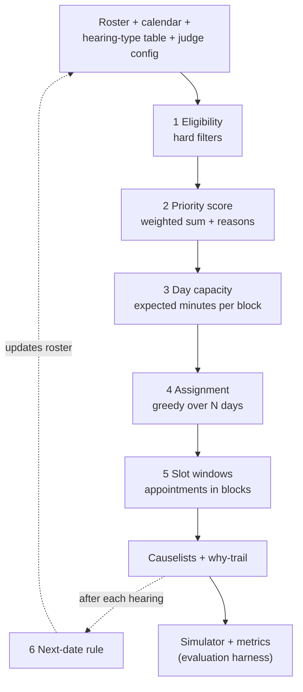

# L1 Scheduling Algorithm: Fixed-Rules Design

Implemented as the L1 POC in `scheduler/` and `sim/` (see `CLAUDE.md`). The schema and numbers here are **assumptions**, to be revised once the organisers release the datasets. Companion to `PUCAR FOSS Hackathon — Understanding Document.md`.

## 1. Summary

L1 is a deterministic pipeline of six stages. It turns a judge's roster into causelists for the next N working days. Each listing gets a time window and a "why" trail. Every stage is a pure function `(state, config) → result + reasons`. L2 and L3 replace individual stages; the pipeline stays the same.

Design principles:

- **Explainable.** Every decision can be traced to a rule and a number. The panel wants a walkthrough of the algorithm.
- **Configurable within locked bounds.** Judges tune their style, but the ageing-case protections can't be switched off.
- **Swappable.** Each stage sits behind a narrow interface, so a statistical or agent-based version can drop in later.

## 2. Pipeline



The simulator is not part of the scheduler. It is the test bench: it plays the schedule forward, draws outcomes, and feeds results back so backlog-age impact can be measured over 60–90 days.

## 3. Data model (assumed)

| Entity | Fields | Source |
| --- | --- | --- |
| Case | `id, filing_date, case_type, stage, next_purpose, advocate_ids[], party_ids[], last_listed, last_heard, adjournment_count, consecutive_skips, prerequisites_met, urgent, on_hold` | Roster sample + generator script |
| HearingType | `purpose, priority (1–5), est_minutes, ideal_gap_days, min_gap_days, p_heard, p_effective` | Hearing-type reference table; `p_*` taken from the hearing-failure distribution |
| Calendar | `holidays[], judge_leave[]` | Court calendar |
| JudgeConfig | `sitting_days, blocks[], max_cases_per_day, listing_factor, weights{}, clustering, rollover_mode, horizon_days` | YAML preset per judge |
| Block | `name, start, end, allowed_purposes[], filter (e.g. age ≥ 4y), weekdays[]` | Inside JudgeConfig |

Placeholder hearing-type values, used in the worked example below. Replace them with the real table once it is released.

| Purpose | Priority | est_minutes | p_heard | p_effective (if heard) | ideal_gap_days | min_gap_days |
| --- | --- | --- | --- | --- | --- | --- |
| Mention | 2 | 5 | 0.40 | 0.50 | 14 | 3 |
| Admission / notice | 3 | 5 | 0.45 | 0.60 | 21 | 7 |
| Interim application | 3 | 10 | 0.40 | 0.50 | 14 | 3 |
| Evidence | 4 | 30 | 0.50 | 0.50 | 28 | 14 |
| Final arguments | 5 | 60 | 0.60 | 0.60 | 21 | 14 |

These values roughly match the case-study funnel: about a third of listed cases are heard, and about half of those are effective.

## 4. Stage rules

### Stage 1: Eligibility (hard filters)

A case is eligible on day `d` only if every check passes:

| Rule | Reason logged when excluded |
| --- | --- |
| `prerequisites_met` is true | "Prerequisite pending (e.g. warrant not served)" |
| `d` is a sitting day, not a holiday or judge leave | "Court not sitting" |
| `d − last_heard ≥ min_gap_days(next_purpose)` | "Too soon after the last hearing" |
| `on_hold` is false | "Stayed or on hold" |

This stage alone removes a whole class of failures. In the case study, about half of the heard-but-ineffective hearings were due to pending prerequisites. It is the cheapest L1 improvement to substantiveness.

### Stage 2: Priority score

```
score = w_age      · age_points(case)          # <1y:0  1–3y:1  3–4y:2  4–5y:3  5y+:5
      + w_purpose  · priority(next_purpose)    # from hearing-type table
      + w_overdue  · max(0, days_past_ideal)   # d − (last_heard + ideal_gap)
      + w_urgent   · urgent                     # 0/1
      + w_adj      · adjournment_count          # repeatedly adjourned cases rise
      + w_fresh    · is_fresh                   # judge style (Joshi uses this)
```

Each term becomes one line of the "why" trail, for example `+25 age 5y+ | +8 final arguments | +6 overdue 12d`. Ties are broken by filing date, oldest first.

### Stage 3: Day capacity

```
block_minutes    = end − start
list_budget      = block_minutes × listing_factor         # listing_factor ≤ locked ceiling
expected_cost(c) = est_minutes(c.purpose) × p_heard(c.purpose)
```

A block is full when the sum of `expected_cost` reaches `list_budget`. Measuring capacity in expected minutes gives a fixed-rule version of airline overbooking. The block is sized to fill the judge's real sitting time, not to a flat count. A hard `max_cases_per_day` backstops it, so a block of 5-minute mentions can't grow without limit.

### Stage 4: Assignment (greedy over the horizon)

```
for day in next N sitting days:
    booked   = cases whose next_date is today (set by stage 6, incl. Sehgal rollovers)
    eligible = stage1(day) sorted by stage2 score
    # 1. booked cases first, into their booked block
    # 2. starvation guard (locked): cases near-missed ≥ K days running, ≤ 20% of the day
    # 3. locked ageing quota: oldest 4y+ cases until ≥ AGE_QUOTA of the day's budget
    # 4. fill each block in its own order (sort_by: score | age | newest)
    for block in today's blocks:
        for case in candidates(block):
            if block has budget and daily cap not reached: place(case, block)
            if clustering: pull up to 4 of the same advocate's other eligible matters into today
    near_miss = the next len(listed) eligible cases by score → consecutive_skips += 1
```

Greedy is the right choice for L1. It is fast, easy to explain one step at a time, and needs no solver. Its objective (maximise total score subject to the budgets) is the same one CP-SAT will optimise at L2.

### Stage 5: Slot windows (a real appointment)

Inside each block:

1. Group cases by advocate, so one advocate's matters sit next to each other.
2. Within each group, put short hearings first.
3. Walk the block, adding up `expected_cost`, and round each case's start to a 30-minute window. If the block is overbooked (listing factor > 1), scale the running total by block minutes ÷ expected minutes, so the extra load spreads across every window instead of piling into the last one.
4. Publish a window such as "14:30–15:30", not an exact minute. Windows absorb no-shows. Windows are one hour and overlap by half an hour: they tell parties when to be in court, and the judge still takes cases one at a time. The block's final half hour gets its own shorter window (e.g. "13:00–13:30").

### Stage 6: Next-date rule (after each hearing)

```
target = hearing_date + ideal_gap_days(next_purpose)
next_date = first day ≥ target where
              day is sitting, a block allows next_purpose and has budget left
              prefer a day where the same advocate already has listings (± 3 days)
if not heard and rollover_mode: next_date = same weekday next week
```

This replaces the flat 60-day default with a gap tied to the purpose of the next hearing.

## 5. Locked rules (in code, not in config)

| Locked rule | Default | Why |
| --- | --- | --- |
| `AGE_QUOTA`: minimum share of daily budget reserved for 4y+ cases | 30% | "Ageing cases getting deprioritised shouldn't be configurable" |
| `w_age` floor | ≥ 3 | A judge's weights can't zero out age |
| Starvation guard `K` | 3 consecutive near-misses (the case was eligible and ranked just below the cut-off); forced cases take at most 20% of the day | No eligible case is starved indefinitely. Counting every skip would force the whole backlog in, because a 3,000-case roster can't fit into 60 slots a day |
| `listing_factor` ceiling | ≤ 1.3 | Caps overbooking |

The config loader clamps any value that breaks these bounds and logs it. Each locked rule gets a unit test.

## 6. Judge presets

| Preset | Key settings | What it demonstrates |
| --- | --- | --- |
| `sehgal.yaml` | Blocks: 11:00–13:30 fresh/notice/mention/IA (`sort_by: newest`); 14:30–16:30 evidence/final arguments (`sort_by: age`); `rollover: true`; `max_cases_per_day: 60` | Blocks and predictable rollover |
| `dimakar.yaml` | `sitting_days` split by purpose (e.g. Mon/Wed arguments, Tue/Thu appearances); `clustering: advocate`; case_type = arbitration | Purpose days and clustering |
| `joshi.yaml` | High `w_fresh`, low `w_age` (clamped to the floor) | The locked rules still pull old cases into Joshi's list, a good demo |

## 7. Worked example: one day for Justice Sehgal

This uses the placeholder table above with `listing_factor = 1.0`. Sitting time is 270 minutes across two blocks.

**Block A, 11:00–13:30 (150 min): fresh, notice, mention and interim applications**

| Listed | Count | Expected cost each | Expected minutes |
| --- | --- | --- | --- |
| Mentions | 30 | 5 × 0.40 = 2.0 | 60 |
| Interim applications | 20 | 10 × 0.40 = 4.0 | 80 |
| **Total** | **50** | | **140 of 150** |

**Block B, 14:30–16:30 (120 min): 4y+ cases (this also covers the ageing quota: 120/270 = 44% ≥ 30%)**

| Listed | Count | Expected cost each | Expected minutes | Window |
| --- | --- | --- | --- | --- |
| Final arguments (Adv. A7, 5y+) | 1 | 60 × 0.60 = 36 | 36 | 14:30–15:30 |
| Evidence (A7's other matter, clustered) | 1 | 30 × 0.50 = 15 | 15 | 15:00–15:30 |
| Evidence (others) | 4 | 15 | 60 | 15:30–16:30 |
| **Total** | **6** | | **111 of 120** | |

**Expected outcome vs baseline**

| Measure | Baseline (case study) | L1 day |
| --- | --- | --- |
| Listed | 60 | 56 |
| Expected heard | 20 | 30×0.40 + 20×0.40 + 5×0.50 + 1×0.60 ≈ 23 |
| Expected effective | 10 | ≈ 12, plus more once the eligibility filter removes prerequisite failures |
| Waiting | All day | 30–60 minute windows |
| Next date | Flat +60 days | 14–28 days by purpose |

**Honest reading of the result.** L1's gains come from structure: filtering out cases that can't proceed, time windows, advocate clustering, the ageing quota and purpose-based next dates. The no-show rate itself stays fixed at L1. Only L2 (predicting who shows up) and L3 (incentives and agent behaviour) can move it. Say this in the pitch as the reason to go to L2.

## 8. Evaluation harness

**Simulator (L1).** A seeded random draw per listing: heard with probability `p_heard`, effective with probability `p_effective`. It advances stage, age, `adjournment_count` and next date, then re-runs the scheduler for the next day. Horizon: 60–90 sitting days.

| Metric | Formula |
| --- | --- |
| Utilisation | heard minutes ÷ sitting minutes |
| Predictability | heard ÷ listed, and the share heard inside their published window |
| Substantiveness | effective ÷ heard |
| Backlog-age impact | count of cases in the 3+, 4+ and 5+ year buckets per week |
| Next-date quality | mean \|actual gap − ideal gap\| per purpose |
| Trips per advocate | distinct court days per advocate per month |

**Baseline.** Run the same simulator with the status-quo policy: list 60 cases a day in filing order, flat +60 days. Report every metric as L1 compared with the baseline.

## 9. Extension seams to L2 and L3

| Seam (interface) | L1 (fixed) | L2 (dynamic) | L3 (behavioural) |
| --- | --- | --- | --- |
| `p_heard(case, day)` | Constant per purpose | scikit-learn classifier on case, advocate and age features | Agent decides to appear (Mesa agents; Laya as a JEV-style decision model) |
| `duration(case)` | Table mean | Sampled from a distribution or predicted | Unprepared agents run longer |
| `solve(cases, capacity)` | Greedy | OR-Tools CP-SAT with the same objective and hard locks | Same |
| `next_date(case, outcome)` | Table gap | Survival model (lifelines) on time until ready | Agents respond to the date offered |
| Simulator outcomes | Fixed rates | Distributions and daily re-planning | Agents with costs and incentives (fees, reminders, preparedness) |
| Overrides | Re-run and diff metrics | Live what-if dashboard | Agents react to the override |

Built for L3 (`docs/L3-agents-laya.md`): `p_heard` → advocate and litigant agents, simulator outcomes → agents with costs, reminders and windows, and a judge agent behind a stage-2 `scorer` and a next-date gap band. Locked placements never read the agent's score.

Rule for the L1 build: no stage may read another stage's internals. Stages talk only through `Case`, `JudgeConfig`, `Causelist` and `Reason` objects.

## 10. Proposed module layout (for the later build)

```
scheduler/
  models.py        # Case, HearingType, JudgeConfig, Block, Listing, Reason
  config.py        # YAML load + locked-rule clamping
  eligibility.py   # stage 1
  scoring.py       # stage 2
  capacity.py      # stage 3 (p_heard, duration live here → L2 swap point)
  assign.py        # stage 4 (solve() → CP-SAT swap point)
  slots.py         # stage 5
  next_date.py     # stage 6
sim/
  simulate.py      # seeded forward run, baseline policy
  metrics.py
presets/{sehgal,dimakar,joshi}.yaml
tests/test_locked_rules.py
```

## 11. Case timeline and summary (insight feature)

**Why.** Judges spend hearing time re-establishing the facts of old cases, and Justice Dimakar wants a cover page before argument hearings. A one-screen story of each case goes straight at that pain point. It also feeds the "which cases are at risk of ageing or repeatedly adjourned" insight the panel asks for.

**What.** Two DuckDB views over tables the scheduler already writes (full spec in `court-domain-model.md` §12, DDL in `scheduler-schema.sql`):

| View | Rows | Built from |
| --- | --- | --- |
| `case_timeline` | One per event: filed, registered, stage change, each hearing (effective / not effective / not heard, with adjournment reasons and next date), order gist, IA filed/decided, notice issued/served, disposed | `court_case`, `case_stage_history`, `hearing`, `hearing_outcome`, `adjournment`, `court_order`, `application`, `task` |
| `case_summary_facts` | One per case: age, stage and since when, hearing counts, last effective hearing, top adjournment reason, open tasks, pending IAs, last order | The same tables |

**Summary text.** L1 uses a fixed template filled from `case_summary_facts`, so every clause traces back to a column. That's the same explainability rule as the why-trail. For example: *"Filed Mar 2019 (7.6 y). 3 hearings: 1 effective, 1 not heard (party absent). In final hearing since 12 Jun 2026. Pending: notice to R2."* Prose summaries from order text with a local open model (Ollama) are optional and come later. The template stays as the fallback.

**In the app.** An expander on each causelist row. A pre-hearing brief for 4y+ cases. A cover page for hearing types listed in the preset's `requires_cover_page_for` (Dimakar).

**Data.** The simulator's hearing log fills the timeline forward from the start date. Earlier history has to be generated from each case's `adjournment_count` and `last_heard`, so it is synthetic until the real roster is released.

## 12. Open items that depend on the datasets

- [ ] Replace the placeholder hearing-type values with the real reference table.
- [ ] Get `p_heard` and `p_effective` per purpose from the hearing-failure distribution.
- [ ] Check which roster fields actually exist, especially prerequisites, advocate IDs and stage.
- [ ] Calibrate `AGE_QUOTA` and `K` against the sample causelist and a baseline run.
