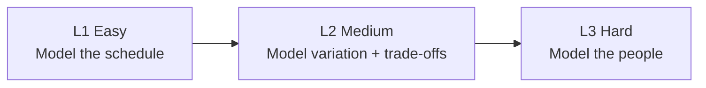

# PUCAR FOSS Hackathon — Understanding Document

Sep 23, 2026 · @Someone

## Overview

**Scheduling Justice** is a one-day PUCAR hackathon run for FOSS United Week. The ask: given one High Court judge's roster and a time window, help the judge decide what to hear, when to hear it and how to structure the day. The two strongest submissions get merged into the **DRISTI 2.0** stack, going live in 3 states, and are then refined with real users and released as open source.

The organisers argue pendency is a time-management problem, not a shortage of judges. Scheduling should be an independent layer that courts can bolt on, not a rebuild of their systems.

| Fact | Value |
| --- | --- |
| High Courts in India | 25 |
| Cases pending across High Courts (NJDG, 31 Dec 2025) | 63.66 lakh |
| Working High Court judges (organisers' estimate) | \~750 of 1,100+ sanctioned |
| Pending cases per working judge | \~8,500 |
| Code deadline | 4:30 PM on the day, pushed to a branch and ready to merge |
| Presentation | 10 minutes per team, to a panel |
| Winners | Top 2 teams or individuals |

**Scope for the day:** one judge's roster in a High Court. Work allocation across judges (the Chief Justice's job) is out of scope. The day's date, venue and team-size rules are not in the brief. Datasets are marked "available tomorrow", so they will be released separately.

## The problem and the seven goals

The core problem is overbooking with no data behind it. Courts list far more hearings than they can hear, most fail, and failed hearings get pushed out by a flat 60 days.

### The case study: Justice Sehgal's roster

- 3,000 pending cases to clear within 3 months. A quarter are under 1 year old, and 1 in 6 are over 4 years old.
- A typical day lists 60 hearings: mostly quick mentions and interim applications, a few 30-minute evidence sessions, and 1–2 final arguments of about an hour each.
- Of the 60 listed, 20 are heard. The other 40 are adjourned because parties don't show up.
- Of the 20 heard, 10 are effective. The other 10 stall: counsel are unprepared, old facts need re-summarising, or a prerequisite is still pending (for example, a warrant not yet delivered).
- Next date defaults to +60 days whatever the next step needs. Overall, about 80% of listed cases are adjourned.

### Who feels it

| Role | Pain |
| --- | --- |
| Litigant | Loses a whole day's work per listing with no idea of the time slot. Doesn't know what's needed from them and depends entirely on their lawyer. |
| Advocate | Has 15 matters across 3 courtrooms and keeps running between them. Watches online hearings on their phone. Depends on goodwill with court staff for convenient listings. Arrives unprepared for old matters. |
| Court Master | Starts every day with a roll call. Juggles everyone's requests with no way to know whether a matter will actually be reached. |
| Judge | Lists more cases than they can hear and switches context constantly. Spends hearings re-establishing facts in old cases. Gets no data on their own progress. |

### The seven goals (tackle one or more)

1. **Minimise trips to court.** Bundle hearings, move actions outside the courtroom, and list the same counsel's cases on the same day.
2. **Generate an optimal causelist.** Cap each day at exactly what can genuinely be heard, and prefer hearings likely to be heard *and* to move the case forward.
3. **Give people a real appointment.** Time slots (for example, 2–4 PM) instead of an all-day wait. Put an advocate's cases in the same slot.
4. **Raise substantive hearing rates.** Collect preparedness and intent-to-appear signals. Don't list cases whose prerequisites aren't met. Summarise old cases, require submissions and send reminders.
5. **Make the next date meaningful.** Set the gap to the real procedural minimum for the next purpose instead of a flat default.
6. **Make scheduling configurable.** Judges set blocks, clustering and ageing quotas without code changes. Some rules stay locked, for example old cases can never be deprioritised.
7. **Data is king.** Give insights and visualisations of what overrides cost. Flag ageing cases, repeat adjournments and stuck stages. Support what-if simulation.

## How it will be judged

Judging has three parts: the scheduling algorithm, the judge-facing insight layer, and how much real-world complexity the model captures. You also need to be able to explain every key decision in the algorithm, and show how the data led to it.

### 1. Scheduling performance

| Metric | What the panel asks |
| --- | --- |
| Utilisation | Is the day well packed, neither overbooked nor leaving capacity unused? |
| Predictability | Are listed cases actually heard, with enough time for their purpose? |
| Substantiveness | When a case is heard, does it move towards resolution? |
| Backlog-age impact | Run forward, do the 5+ year buckets shrink? Old cases must not be deprioritised. |
| Next-date recommendation | Is the suggested next date sensible and efficient? |

### 2. Visualising insight

Judges may override the algorithm. The system should show what each override costs. Example questions it should answer:

- What happens to utilisation if I move these 10 cases?
- What happens to predictability if I overbook this day?
- Which cases are at risk of ageing further, or have been adjourned repeatedly?
- Where is my docket starting to drift?
- What happens to my 3+ and 4+ year backlog, and to the next few weeks, if I choose this option?

### 3. Submission complexity

| Level | What it means | Examples from the brief |
| --- | --- | --- |
| L1 | Fixed rules | Simple optimisation algorithm, fixed prioritisation, walkthrough, basic schedule view |
| L2 | Distributions, costs and dynamics | Distributions for duration, adjournment, case type, lawyer availability and gaps. Re-plans on new information, models costs and incentives, shows override impact, uses a small prediction model |
| L3 | Behavioural or agent-based | Litigant, lawyer and judge agents with simple personalities decide whether to appear, seek an adjournment or react to a change. Uses a "JEV-style tool or small model" |

**What "JEV-style" means:** Jev is TypeSafe AI's first "System One" model. Unstructured state goes in, and a typed decision with a calibrated probability comes out in about 70–500 ms. It is built for fast, repeated choices inside software, not for chat. For L3, that fits agents deciding things like "will I appear?" or "do I seek an adjournment?" at every simulated hearing. Jev is a closed, paid API in early access, so a FOSS build should use an open equivalent (see the tooling table).

The brief's own advice: "when in doubt — simply simplify".

## Domain context

Scheduling is a chain of three decisions. The hackathon covers the last two, for one judge.

### Glossary

| Term | Meaning |
| --- | --- |
| Roster / docket | The set of cases assigned to one judge |
| Causelist | The day's schedule of hearings, and the main output of the tool |
| Purpose of hearing | What the hearing is for: mention, admission, notice, interim application, evidence, arguments, final arguments |
| Heard vs effective | *Heard* means the case was reached. *Effective* (substantive) means its purpose was met and the case moved to the next stage |
| Adjournment | Hearing pushed to a later date because of non-appearance, unpreparedness or an unmet prerequisite |
| Next date | The date set for the next hearing. It defaults to +60 days today |
| Case age | Time from filing date to today. The brief uses 3+, 4+ and 5+ year buckets |
| Court Master | Court staff who run the courtroom day, including the roll call |

### Three judge styles to support through configuration

| Judge | Style | Rules the tool must express |
| --- | --- | --- |
| Justice Sehgal | Block scheduler | Lists 10 cases per day. Unheard cases roll to the same weekday next week. Time blocks by purpose: 11:00–13:30 fresh and notice matters, 14:30–16:30 oldest matters |
| Justice Dimakar | Clusterer (arbitration only) | Groups by purpose on fixed days and by advocate. Requires a cover page summarising facts before argument hearings. Aims to hand over a docket with fewer old cases |
| Justice Joshi | New matters first | Takes fresh, fast cases first to build a track record. Old, complex files keep slipping, which is the behaviour the locked ageing rule exists to catch |

### Data provided (released separately)

- A sample judge roster, plus a script to generate more cases
- The court holiday calendar, with the judge's personal leave handled separately
- A sample causelist from current practice
- A hearing-type reference table: priority, time to complete, and ideal gap to the next date
- A hearing-failure distribution: why listed hearings don't happen or don't move forward

Fields to estimate or generate yourself: case age, advocate and party IDs (for clustering), hearing duration, adjournment and no-show likelihood, and judge style preferences. The brief also invites capturing new data such as next hearing purpose, actual duration, and live-updated no-show likelihood.

**Analogies the organisers use:** airline overbooking based on no-show data, surgeons' pre-packed days, restaurant deposits and no-show fees, and ride-hailing's live re-planning.

## Suggested FOSS tooling

I recommend a self-contained Python scheduling service with a REST API and a thin dashboard, built only from OSI-licensed parts. That matches the brief's idea of a scheduler as a separate layer courts can bolt on, and it keeps the code ready to open-source. Licences below are from my own knowledge, not checked against each project today.

| Need | Primary pick (licence) | Alternative | Why |
| --- | --- | --- | --- |
| Causelist optimisation | Google OR-Tools CP-SAT (Apache-2.0) | HiGHS (MIT); Timefold Solver (Apache-2.0, Java) | Handles time blocks, capacities, advocate clustering, locked ageing quotas and soft priorities in one model |
| Data wrangling | pandas or Polars (BSD-3 / MIT) | DuckDB (MIT) | Load the roster, calendar and reference tables, and compute age buckets |
| Synthetic data | NumPy + SciPy distributions (BSD-3), Faker (MIT) | — | Draw durations, no-show rates and advocate IDs from the provided distributions |
| No-show and adjournment prediction (L2) | scikit-learn (BSD-3) | LightGBM (MIT) | A small classifier for P(heard) and P(effective) per listing |
| Next-date and time-to-event (goal 5) | lifelines (MIT) | statsmodels (BSD-3) | Survival models for time until a case's prerequisites are ready |
| Forward simulation and what-ifs | SimPy (MIT) | Plain Python loop | Discrete-event run of weeks of court days to measure backlog-age impact |
| Agent-based model (L3) | Mesa (Apache-2.0) | SimPy processes with rule-based agents | Litigant, lawyer and judge agents with simple personalities |
| Agent decisions, JEV-style (L3) | Laya (Apache-2.0), an open System One-style decision model | Jev API (closed, early access, not FOSS); a scikit-learn classifier | One fast, calibrated, typed choice per agent per hearing (appear, seek adjournment, be ready). Mesa or SimPy runs the agents; keep a rule-based fallback for explainability |
| LLM-driven agents or case summaries (optional) | Ollama or llama.cpp (MIT) running an Apache-2.0 model such as Mistral 7B | — | Runs locally, so no proprietary API and no case data leaves the machine |
| API | FastAPI + Pydantic (MIT) | — | Lets DRISTI call the scheduler as a service |
| Judge rules config (goal 6) | YAML or JSON validated by Pydantic | JSON Schema | Judges change rules without code. Locked rules are enforced in the solver, not in the config file |
| Storage | SQLite (public domain) | PostgreSQL (PostgreSQL licence) | SQLite for the demo, Postgres if DRISTI needs it |
| Dashboard and what-if UI | Streamlit (Apache-2.0) + Plotly (MIT) | React + Apache ECharts (Apache-2.0) + FullCalendar standard (MIT) | Streamlit is fastest in a one-day build. React fits a production UI better |
| Packaging | Podman or Docker Engine (Apache-2.0) | — | One-command demo, easier to merge |
| Tests | pytest (MIT) | — | Check that the locked ageing rules can't be violated |

**Mapping to levels:** OR-Tools plus a fixed-rule config reaches L1. Adding the scikit-learn predictors, distribution sampling and SimPy what-ifs gives L2. Adding Mesa agents that respond to costs and incentives gives L3.

**Stack caveat:** check which language and stack DRISTI 2.0 uses before committing. If it is Java-based, Timefold Solver is the closest FOSS equivalent to OR-Tools for merging.

## Open questions and risks

The biggest unknowns are the dataset formats and how DRISTI expects code to be merged. Both decide the stack before any build starts.

### Questions for the organisers

- [ ] Is "court staff" in the scheduling step the same as the Court Master? (from `queries.md`)
- [x] What is a "JEV-style tool" in the L3 examples? Answered: TypeSafe AI's Jev, a fast typed-decision model (see Submission complexity).
- [ ] What format and schema will the datasets use, and how big is the sample roster?
- [ ] Which repo and branch should we push to, and what language, licence and API conventions does DRISTI 2.0 expect?
- [ ] Will metrics be scored by running our scheduler on a shared hidden dataset, or judged from the demo?
- [ ] Which rules are locked beyond "ageing cases aren't deprioritised"? Is there a minimum quota for old cases?
- [ ] Are hosted LLM APIs allowed, or only local and open models?
- [ ] Should advocates' clashes with other courtrooms be modelled when only one judge's roster is provided?
- [ ] What are the event date, team size and eligibility rules? None are in the brief.

### Risks

- **Scope creep:** there are 7 goals and 3 levels, and only one day. A working L1 with one strong L2 feature likely beats a half-built L3.
- **Explainability:** the panel wants every algorithm decision walked through, so a black-box model hurts the score.
- **Trust:** judges will override the system, so the cost of each override must be visible, not only the optimal plan.
- **Data realism:** most behavioural inputs are synthetic, so results depend on distributions we choose. State those assumptions explicitly.
