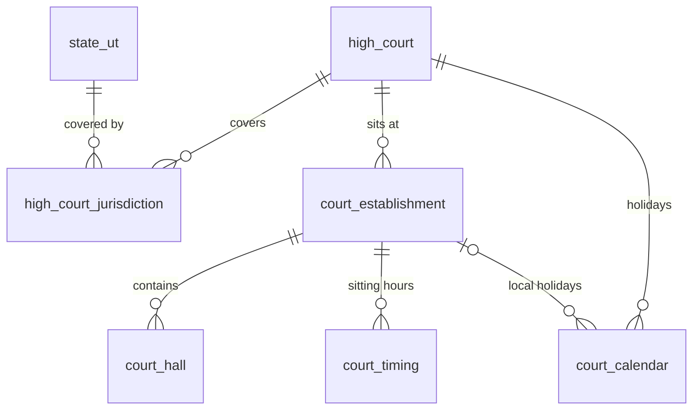
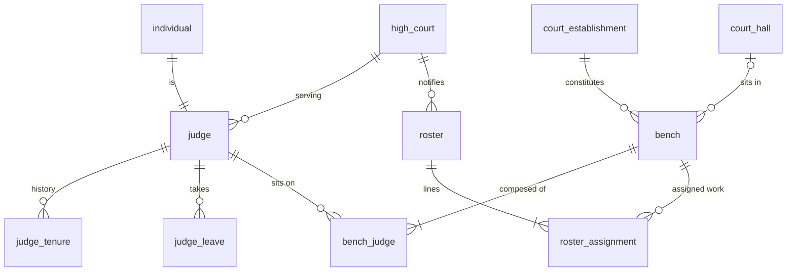
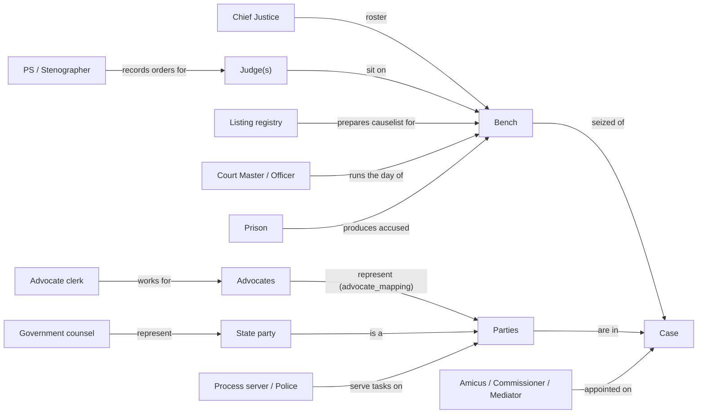
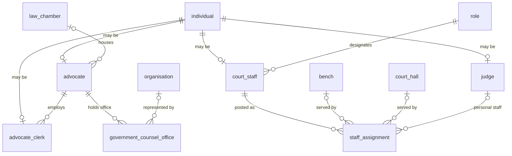
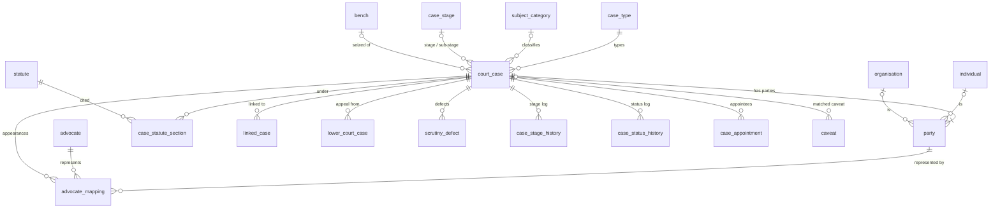
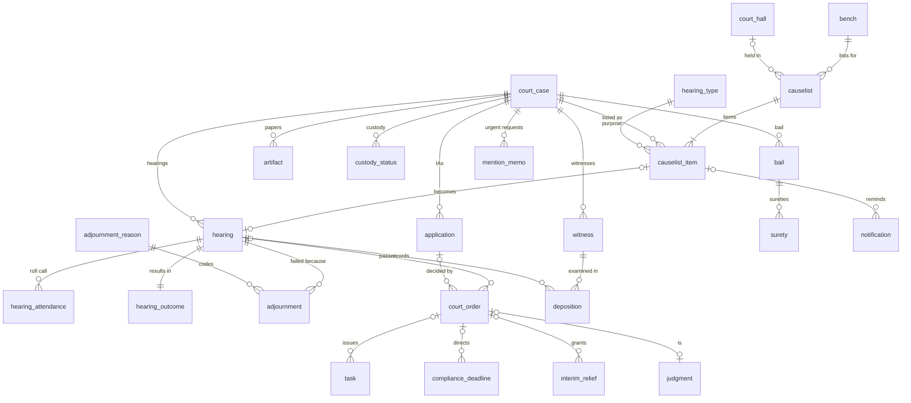
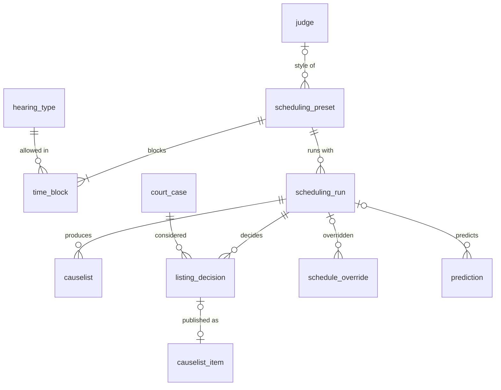
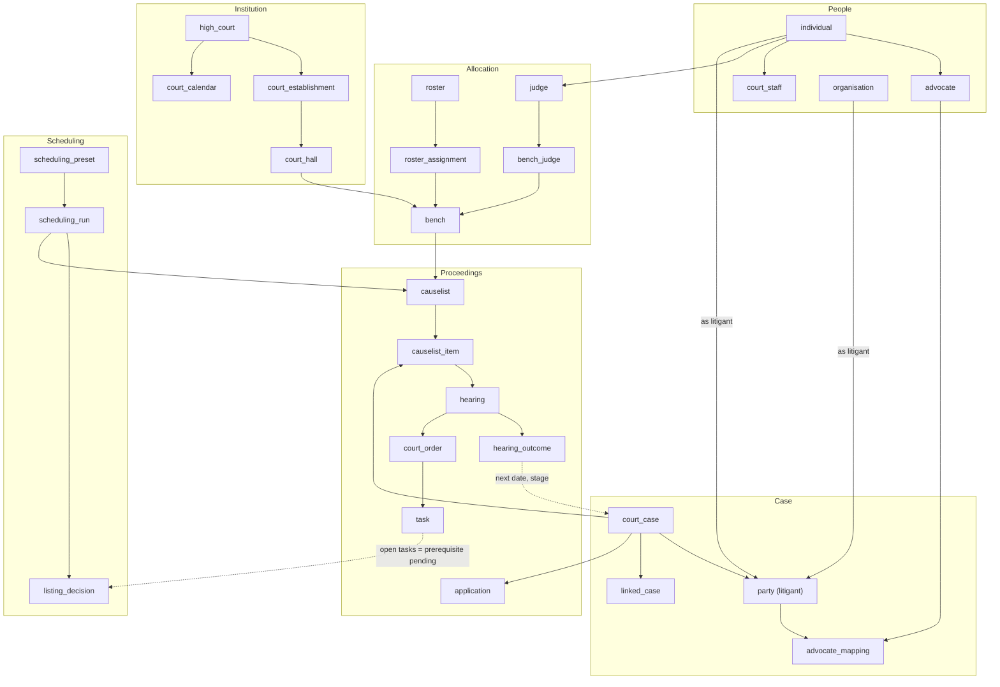

# High Court Domain Model

The entities, tables, case lifecycle and roles of an Indian High Court, with DRISTI-aligned names. The full DDL is in `court-schema.sql` (72 tables). The subset the scheduling tool actually uses is in `scheduler-schema.sql` (23 tables plus the case-timeline views; see §12). Both load into an empty DuckDB with no errors.

**This does not change the project goal.** We are still building a scheduler for one High Court judge's roster: causelists, time windows, next dates and insights. This model is background. It tells us where the scheduler's inputs come from, what its outputs connect to, and what each role needs to see (for the causelist-calendar skill). Tables outside the scheduler's path are documented for completeness and marked **—** in the *Scheduler* column. None of this is wired into code yet.

Companion to `L1-scheduling-algorithm.md` and `PUCAR FOSS Hackathon — Understanding Document.md`.

## 1. Summary and conventions

**Scope.** High Court only. Lower courts, tribunals and the Supreme Court appear only as references: the order an appeal challenges (`lower_court_case`) and an SLP filed against a High Court order (`linked_case`).

**Why DRISTI naming.** Winning code is merged into DRISTI 2.0, so we reuse its entity names and identifiers (`court_case`, `party`, `advocate_mapping`, `hearing`, `application`, `task`, `artifact`, `witness`, `filing_number`, `cnr_number`, `individual_id`, `tenant_id`), converted to snake_case. The source is the OpenAPI specs in [`pucardotorg/dristi-solutions/api_specifications`](https://github.com/pucardotorg/dristi-solutions/tree/develop/api_specifications). DRISTI today is built around trial-court work (NI Act §138 cheque-bounce cases). Its specs have no roster, bench composition, causelist or court calendar, which a High Court needs. We add those as our own tables (§10a).

**Conventions**

| Rule | Detail |
| --- | --- |
| Identifiers | `id` is a UUID string. Reference ("master") tables are keyed by a short `code` |
| Tenant | `tenant_id` = the High Court (DRISTI `tenantId`) |
| Audit | Transactional tables carry DRISTI `auditDetails` as `created_by, created_time, last_modified_by, last_modified_time` |
| Extensibility | Every table has `additional_details JSON` for court-specific fields |
| Soft delete | `is_active` where DRISTI has it. History tables are append-only |
| Vocabularies | `CHECK` only for small closed sets. Open lists (case types, stages, purposes, reasons) are master tables |
| Reserved words | DRISTI `Order` → `court_order`, because `order` is reserved in SQL |
| Indicative values | Every example value (case-type codes, designations, stage names) is **indicative and varies by High Court**. Load them as data; never hard-code them (CLAUDE.md) |

**Scheduler column legend** used in the table catalogues:
- **L1**: read or written by the L1 scheduler as built.
- **L2+**: needed for L2/L3 (predictions, overrides, agents).
- **ctx**: used only to derive a field the scheduler reads.
- **—**: context only.

**Table count by section**

| Section | Tables |
| --- | --- |
| §2 Institution and places | 7 |
| §3 Judges, benches, roster | 7 |
| §4 People and roles | 11 |
| §5 The case (incl. `case_appointment`) | 17 |
| §6 Proceedings (incl. `hearing_type`) | 24 |
| §8 Scheduling layer | 6 |
| **Total** | **72** |

## 2. Institution and places

India has 25 High Courts. Several cover more than one state or UT: Bombay covers Maharashtra, Goa, Dadra & Nagar Haveli and Daman & Diu; Gauhati covers Assam, Nagaland, Mizoram and Arunachal Pradesh; Punjab & Haryana also covers Chandigarh; Kerala also covers Lakshadweep. A High Court sits at a **principal seat** and may have **permanent benches** (e.g. Bombay at Nagpur, Aurangabad, Goa and Kolhapur) or **circuit benches**. eCourts treats each seat as an **establishment**, and the establishment code forms the first six characters of every CNR.

| Table | Purpose | Key fields | Scheduler |
| --- | --- | --- | --- |
| `state_ut` | States and UTs | `code` (ISO 3166-2:IN), `kind` | — |
| `high_court` | The tenant | `tenant_id`, `name`, `principal_seat_city`, `sanctioned_strength` | ctx |
| `high_court_jurisdiction` | High Court ↔ state/UT, many-to-many | `tenant_id`, `state_ut_code` | — |
| `court_establishment` | Principal seat, permanent bench or circuit bench | `kind`, `establishment_code`, `city` | ctx |
| `court_hall` | The physical courtroom | `hall_number`, `floor`, `vc_enabled`, `seating_capacity` | L1 (calendar location) |
| `court_calendar` | Holidays, vacations, vacation sittings, working Saturdays | `day`, `day_type`, `establishment_id` (NULL = whole court) | **L1** (`is_sitting_day`) |
| `court_timing` | Standard sitting hours and lunch recess per weekday | `sitting_start`, `lunch_start/end`, `sitting_end` | **L1** (block bounds) |

## 3. Judges, benches and roster

Work allocation is the first link in the brief's chain (*Chief Justice → rosters*) and is **out of scope for the hackathon**. We model it so we know where "one judge's roster" comes from.

- **Judges.** High Court judges are appointed under Article 217 and retire at **62**. Additional judges (Article 224) serve up to two years before they are confirmed or dropped. Seniority decides who presides on a division bench.
- **Master of the roster.** The Chief Justice decides which bench hears which classes of work, and publishes this as the *roster* or *determination*. A roster line reads like "WP(C) (service matters) of 2015–2018, after notice, Mon/Wed, Court 12".
- **Benches.** A bench is a sitting constituted for a period:
  - **single**: one judge;
  - **division**: two judges (writ appeals, criminal appeals against conviction, PILs);
  - **full / larger**: three or more judges (references);
  - **special**: e.g. a bench constituted for PILs or tax matters;
  - **vacation**: urgent matters during court vacations.

  A judge can sit on a single bench in the morning and a division bench in the afternoon. Hence `bench` + `bench_judge`, not a `judge.court_hall` column.
- **Part-heard matters** stay with the bench that began hearing them (`court_case.is_part_heard` + `bench_id`), even after the roster changes.

| Table | Purpose | Key fields | Scheduler |
| --- | --- | --- | --- |
| `judge` | A High Court judge | `designation` (chief_justice, acting_chief_justice, judge, additional_judge), `seniority_rank`, `date_of_retirement`, `status` | **L1** (whose roster) |
| `judge_tenure` | Appointment, confirmation, transfer and elevation history | `event`, `valid_from/to`, `notification_ref` | — |
| `judge_leave` | Personal leave, separate from court holidays (brief) | `from_date`, `to_date`, `session`, `notified_on` | **L1** (`JudgeConfig.leave`) |
| `bench` | A constituted sitting for a period | `bench_type`, `strength`, `court_hall_id`, `valid_from/to` | **L1** (causelist owner) |
| `bench_judge` | Judges on a bench | `is_presiding`, `seat_order` | ctx |
| `roster` | The Chief Justice's roster notification | `effective_from/to`, `issued_by_judge_id` | ctx |
| `roster_assignment` | One roster line: bench × case types × subject × stage × filing years × weekdays × session | `case_type_codes[]`, `stages[]`, `filing_year_from/to`, `weekdays[]` | ctx (defines the roster) |

The judge's scheduling *style* (the YAML presets) is `scheduling_preset` in §8, not a judge column, because a preset can outlive a bench composition and vice versa.

## 4. People and roles

Every person is an `individual` (DRISTI `individualId`). A role is a *relationship* between that person and a court, bench or case, never an attribute of the person. The same advocate can be petitioner's counsel in one case, Public Prosecutor in another, and amicus curiae in a third.

| Table | Purpose | Key fields | Scheduler |
| --- | --- | --- | --- |
| `individual` | Base identity for every human | `name`, `date_of_birth` (senior-citizen priority), `mobile_number`, `email`, `preferred_language`, `has_disability` | ctx (calendar recipients) |
| `organisation` | Government departments, PSUs, companies, statutory bodies, law firms | `kind`, `parent_id` (department hierarchy) | ctx |
| `role` | Catalogue of every role code (table below) | `code`, `category` | ctx |
| `court_staff` | Registry and courtroom staff | `designation`, `role_code`, `establishment_id` | — |
| `staff_assignment` | Staff ↔ bench, court hall or judge, for a period | `role_code`, `bench_id`, `court_hall_id`, `judge_id` | ctx (Court Master calendar) |
| `law_chamber` | An advocate's chamber or firm | `name`, `organisation_id` | — |
| `advocate` | DRISTI Advocate | `bar_registration_number`, `state_bar_council`, `enrolment_date`, `designation` (advocate, senior_advocate) | **L1** (clustering) |
| `advocate_clerk` | DRISTI AdvocateClerk: files papers, tracks listings | `state_regn_number`, `advocate_id` | — |
| `government_counsel_office` | Law officers of the State or Union for a period | `office_role`, `represents_org_id` | L2+ (one PP appears in hundreds of matters: clustering and clash risk) |
| `police_station` | For criminal matters (FIR origin, service of process) | `name`, `district` | — |
| `prison` | For producing undertrials, often by VC | `vc_enabled` | — |
| `case_appointment` (§5) | Court appointees on a case: amicus, commissioner, mediator, interpreter, legal-aid counsel, receiver | `role_code`, `appointed_by_order_id` | — |

### Role catalogue

Designations differ across High Courts. For example, the person who calls the list may be a *Court Master*, *Court Officer*, *Bench Secretary* or *Reader*. Whether the brief's "court staff" means the Court Master is still an open question in `queries.md`.

| Category | Role code | Who | What they do that matters for scheduling |
| --- | --- | --- | --- |
| judicial | `chief_justice` | Chief Justice | Master of the roster; constitutes benches; decides urgent mentioning in some courts |
| judicial | `judge` | Puisne or additional judge | Hears, orders, fixes next date, overrides the list |
| registry | `registrar_general` | Registrar General | Head of registry; notifies roster and calendar |
| registry | `registrar_judicial` | Registrar (Judicial) | Scrutiny, registration, listing policy |
| registry | `registrar_listing` | Registrar / Deputy Registrar (Listing) | Prepares and publishes causelists (**the scheduler's institutional home**) |
| registry | `registrar_it` | Registrar (Computerisation) / Central Project Coordinator | Runs CIS / DRISTI; would deploy the scheduler |
| registry | `filing_clerk` | Filing counter / e-filing section | Receives filings, assigns filing number |
| registry | `scrutiny_clerk` | Scrutiny section | Raises defects before registration |
| registry | `copying_section` | Copying section | Certified copies (needed to file appeals) |
| courtroom | `court_master` | Court Master / Bench Secretary | Roll call, records proceedings, drafts orders, fields requests to pass over or adjourn |
| courtroom | `court_officer` | Court Officer / Reader / Bench Clerk | Calls items, manages the file flow into court |
| courtroom | `private_secretary` | PS / Stenographer to the judge | Takes dictation of orders and judgments |
| courtroom | `usher` | Usher / Chobdar / Jamadar | Escorts the judge, calls parties outside the hall |
| process | `process_server` | Process server / Bailiff (Nazir section) | Serves summons and notices; their returns clear prerequisites |
| bar | `advocate` | Advocate on record for a party | Appears; seeks adjournments; runs between courtrooms |
| bar | `senior_advocate` | Designated Senior Advocate | Argues when briefed; needs an advocate on record; very clash-prone |
| bar | `advocate_clerk` | Registered clerk | Tracks causelists, files papers on the advocate's behalf |
| government_counsel | `advocate_general` / `additional_advocate_general` | State's chief law officer and deputies | Appear for the State in important matters |
| government_counsel | `government_pleader` | Government Pleader | State in civil and writ matters |
| government_counsel | `public_prosecutor` | Public Prosecutor / APP | State in criminal matters, bail |
| government_counsel | `asg` / `cgsc` | Additional Solicitor General / Central Govt Standing Counsel | Union of India |
| government_counsel | `standing_counsel` | Standing counsel for a statutory body or PSU | Appears for the body across many matters |
| party | `petitioner` / `appellant` / `applicant` | Moves the court | Must appear or be represented |
| party | `respondent` / `proforma_respondent` | Opposite side | Must be served before an effective hearing |
| party | `complainant` / `accused` | Criminal parties | Accused may be in custody (priority) |
| party | `state` | State / Union of India | Represented by government counsel |
| party | `caveator` / `intervenor` | Entitled to notice / permitted to intervene | Caveat must be cleared before a fresh matter is heard |
| party | `party_in_person` | Litigant without an advocate | Needs plain-language notices |
| court_appointee | `amicus_curiae` | Advocate assisting the court | Appointed by order |
| court_appointee | `court_commissioner` | Local inspection, recording evidence | Report is a prerequisite for the next hearing |
| court_appointee | `mediator` | High Court mediation centre | Mediation report pauses listing |
| court_appointee | `interpreter` | Interpreter / translator | Must be booked with the hearing |
| court_appointee | `legal_aid_counsel` | HCLSC-assigned advocate | For legal-aid litigants and undertrials |
| state_agency | `investigating_officer` | Police IO | Case diary / status report is a prerequisite in bail matters |
| state_agency | `prison_officer` | Jail superintendent | Produces the accused, physically or by VC |

### How the roles relate

### Role × lifecycle matrix

Legend: **D** = does or decides; **P** = takes part or is affected; **I** = informed; blank = no part.

| Lifecycle step | Judge | Listing registry | Court Master | Scrutiny / filing | Process server | Advocate | Govt counsel | Party | Appointees |
| --- | --- | --- | --- | --- | --- | --- | --- | --- | --- |
| E-filing | | | | P | | D | D | P | |
| Scrutiny and defects | | | | D | | P | P | I | |
| Registration (case no, CNR) | | I | | D | | I | | I | |
| Listing (causelist) | P (overrides) | **D** | P | | | I | I | I | |
| Roll call / calling the list | P | | **D** | | | P | P | P | |
| Hearing | **D** | | P | | | P | P | P | P |
| Order and next date | **D** | I | P (drafts) | | | I | I | I | |
| Issue of notice / summons / warrant | D (orders) | | P | P (process section) | **D** | P (dasti) | | P | |
| Service return (prerequisite cleared) | | I | | | **D** | P | | P | |
| Pleadings (counter, rejoinder) | | | | P | | **D** | **D** | P | |
| Interim applications | **D** | P | | P | | D | D | P | |
| Evidence (original side) | D | | P | | | D | D | P | Commissioner **D** |
| Final arguments | **D** | | | | | **D** | **D** | I | Amicus P |
| Judgment reserved / pronounced | **D** | P (lists for judgment) | P | | | I | I | I | |
| Disposal and certified copy | | | | P (copying) | | P | P | I | |

This matrix drives the per-role calendar views in `.claude/skills/causelist-calendar/SKILL.md`. Each role's calendar shows the steps where it has **D** or **P**.

## 5. The case

### Identifiers

A High Court case carries up to four numbers, each assigned at a different point:

| Number | When | Example | Column |
| --- | --- | --- | --- |
| Filing number | E-filing, before scrutiny | `KL-001234-2026` | `filing_number` (unique) |
| Miscellaneous (CMP) number | Pre-registration applications in some courts | `CMP 45/2026` | `cmp_number` |
| Registration number | After scrutiny is cleared | `WP(C) 1234/2026` | `case_type_code` + `registration_number` + `registration_year`, display `court_case_number` |
| CNR | On registration: 16 characters, establishment code (6) + serial (6) + year (4) | `KLHC010012342026` | `cnr_number` (unique) |

**Case age** is measured from `filing_date`, as in the brief and `scheduler/models.py`. NJDG also reports age from registration. Keep both dates.

### Reference tables

| Table | Purpose | Examples (indicative) | Scheduler |
| --- | --- | --- | --- |
| `case_type` | Case types with jurisdiction, nature, default bench strength, limitation | WP(C), WP(Crl), WA / LPA (intra-court writ appeal), OP, RSA, RFA/FA, CRP, MACA, CRL.A, CRL.RC, Bail Appl, Crl.M.C, Arb.P, Arb.A, CS / OS (original side), Co.P, Cont.Case (C/Crl), RP (review), PIL, ITA / tax appeals, EP (election petition) | **L1** (`case_types` filter) |
| `subject_category` | NJDG-style subject tree | Service, land acquisition, motor accident, tax, labour, family, arbitration, NI Act | L2+ (duration and adjournment features) |
| `statute` | Acts | CPC 1908, BNSS 2023 (formerly CrPC), BNS 2023, NI Act 1881, Arbitration Act 1996, Constitution (Art. 226/227) | — |
| `case_stage` | Stage and sub-stage vocabulary (DRISTI `stage`, `subStage`) with `default_purpose` | See §7 | **L1** (drives purpose) |
| `disposal_nature` | How a case ended | allowed, dismissed, partly allowed, withdrawn, infructuous, dismissed for default, settled, transferred, abated, disposed of | L1 (sim: disposal) |

### Transactional tables

| Table | Purpose | Key fields | Scheduler |
| --- | --- | --- | --- |
| `court_case` | DRISTI CourtCase: the case | IDs above; `filing_date`; `stage_code`, `sub_stage_code`; `status`; `bench_id`, `judge_id`; priority flags (`is_urgent`, `is_senior_citizen`, `is_woman_litigant`, `is_child_related`, `is_in_custody`, `is_legal_aid`, `is_pil`, `is_on_hold`); cached listing state (`next_hearing_date`, `next_purpose_code`, `last_heard_date`, `adjournment_count`, `consecutive_skips`) | **L1** |
| `case_statute_section` | DRISTI StatuteSection | `statute_code`, `sections[]` | — |
| `lower_court_case` | The order under challenge (appeals, revisions) | `court_level`, `court_name`, `decision_date` | L2+ (age of the dispute) |
| `linked_case` | DRISTI LinkedCase | `relationship_type` (tagged, connected, batch, cross_appeal, review_of, contempt_of, appeal_from, restoration_of, transferred_from, slp_against, execution_of), `lead_case` | L2+ (tagged matters list together) |
| `party` | DRISTI Party | `party_type`, `party_number` (P1, R3), `is_party_in_person`, `is_state`, `impleaded_on`, `deleted_on`, `legal_representative_of` | ctx (litigant calendar) |
| `advocate_mapping` | DRISTI AdvocateMapping / Representative | `advocate_id`, `party_id`, `advocate_type` (primary, support, senior_briefed), `vakalatnama_date`, `noc_date` | **L1** (`Case.advocate_ids`) |
| `caveat` | Caveat lodged in anticipation of a filing (CPC s.148A, 90 days) | `expires_on`, `matched_case_id` | L2+ (fresh matter can't be heard until caveator notified) |
| `scrutiny_defect` | Defects before registration | `raised_on`, `cure_deadline`, `cured_on` | — |
| `court_fee_payment` | Fees, costs, fines | `purpose`, `amount` | — |
| `case_stage_history` | Every stage change | `from_stage_code`, `to_stage_code`, `changed_on` | **L1 insight** ("stuck stages") |
| `case_status_history` | Every status change | `to_status`, `changed_on` | ctx |
| `case_appointment` | Amicus, commissioner, mediator, interpreter, legal-aid counsel | `role_code`, `appointed_on`, `discharged_on` | — |

**Priority flags are cached.** `is_senior_citizen` is derived from `individual.date_of_birth` of a party, `is_in_custody` from `custody_status`, `is_urgent` from applications and mention memos. They sit on `court_case` because scoring needs them for thousands of cases per run, and a join per case would be wasteful. The source rows stay the truth.

## 6. Proceedings

This section runs from the causelist through the hearing to what the hearing produces (orders, tasks, deadlines, next date). It is the scheduler's own ground.

### Listing

In practice the **listing registry** prepares causelists from the roster and listing rules, and the judge adjusts them. Our scheduler replaces the registry's rule of thumb (list 60, flat +60 days) with a planned list.

| Table | Purpose | Key fields | Scheduler |
| --- | --- | --- | --- |
| `causelist` | One published list per bench per date per list type | `list_type` (daily, supplementary, advance, weekly, vacation, special), `status` (draft → approved → published → revised), `scheduling_run_id` | **L1 output** |
| `causelist_item` | One listed case | `serial_number` (item no.), `list_section` (fresh, admission, after_notice, for_orders, final_hearing, part_heard, judgment, mention), `purpose_code`, `application_ids[]`, `tag_group`, `time_block`, `window_start/end`, `expected_minutes`, `score`, `reasons[]`, `was_booked` | **L1 output** (`Listing`) |
| `mention_memo` | Request for urgent or out-of-turn listing | `requested_date`, `decision`, `granted_date` | L2+ (re-plan on new information) |
| `application` | DRISTI Application: IA / CMP / MP | `application_type_code`, `status`, `is_urgent`, `filed_by_party_id` | L1 (purpose `interim_application`) |
| `application_type` | IA vocabulary: stay, condonation of delay, bail, suspension of sentence, amendment, impleadment, exemption, early hearing, vacate stay, extension of time, restoration, withdrawal | `hearing_type_code`, `is_urgent_by_default` | ctx |

### The hearing and what it produces

| Table | Purpose | Key fields | Scheduler |
| --- | --- | --- | --- |
| `hearing_type` | Purpose of hearing (DRISTI `hearingType`; `scheduler/data.py` `HEARING_TYPES`) | `priority`, `est_minutes`, `p_heard`, `p_effective`, `ideal_gap_days`, `min_gap_days`, `next_purpose_code` | **L1** |
| `hearing` | DRISTI Hearing: one per case per sitting where it is called | `hearing_type_code`, `status` (scheduled, in_progress, in_transcription, adjourned, closed, cancelled), `bench_id`/`judge_id`/`court_hall_id` (DRISTI `presidedBy`), `start_time`, `end_time`, `mode`, `vc_link`, `cnr_numbers[]` (tagged matters) | **L1** (sim log) |
| `hearing_attendance` | DRISTI HearingAttendee plus the roll-call result | `attendee_type`, `was_present`, `attendance_mode`, `arrived_at` | L2+ (no-show model) |
| `hearing_outcome` | What the hearing achieved, kept apart from DRISTI's workflow status | `was_reached`, `was_heard`, `was_effective`, `actual_minutes`, `within_window`, `stage_before/after_code`, `next_hearing_date`, `next_purpose_code`, `next_date_source` | **L1 metrics** |
| `adjournment_reason` | Hearing-failure taxonomy | `failure_kind` (not_heard, heard_not_effective), `attributable_to`, `preventable_by_scheduler` | **L1** (sim), L2+ |
| `adjournment` | One row per reason a hearing failed | `reason_code`, `sought_by_*`, `costs_imposed`, `is_last_opportunity` | **L1 insight** (repeat adjournments) |
| `court_order` | DRISTI Order | `order_type_code`, `order_category`, `hearing_id`, `application_id`, `order_date`, `status` | ctx |
| `order_type` | Order vocabulary: notice, interim stay, adjournment, admission, directions, dismissal, disposal, judgment, bail, warrant, summons | `order_category`, `ends_case` | ctx |
| `judgment` | Reserved and pronounced judgments | `reserved_on`, `pronounced_on`, `author_judge_id`, `neutral_citation`, `is_reportable` | L1 (purpose `judgment`: reserved judgments age too) |
| `task` | DRISTI Task: process issued on an order | `task_type` (summons, notice, warrant, bail.cash, bail.surety, document.submission), `service_mode`, `service_status`, `served_on`, `due_date`, `blocks_hearing_type` | **L1** (source of `prerequisites_met`) |
| `compliance_deadline` | Time-bound directions: file counter in 4 weeks, cure defects, deposit | `action`, `due_date`, `complied_on`, `blocks_hearing_type` | **L1** (prerequisite), L1 next date |
| `interim_relief` | Stays and injunctions in force | `valid_until`, `vacated_on` | L2+ (expiry forces a listing) |
| `artifact` | DRISTI Artifact: pleadings, affidavits, written submissions, cover page, exhibits | `artifact_type`, `filing_type`, `source_type`, `is_evidence` | L2+ (Dimakar's cover page is a prerequisite for arguments) |
| `witness` | DRISTI Witness (original side, election petitions) | `witness_identifier` (PW1, DW2), `cited_by_party_id` | — |
| `deposition` | Examination of a witness at a hearing | `examination` (chief, cross, re-examination) | L2+ (evidence spans hearings) |
| `custody_status` | Accused custody over time | `status` (in_custody, on_bail, sentence_suspended, absconding), `prison_id`, `crime_number` | ctx (`is_in_custody` priority) |
| `bail` | Bail granted / cancelled | `bail_type` (regular, anticipatory, interim, default, suspension_of_sentence), `bond_amount`, `conditions[]` | — |
| `surety` | Sureties for a bail | `amount`, `is_verified` | — |
| `notification` | SMS / email / app / .ics reminders | `channel`, `template`, `sent_at`, `acknowledged_at`, `will_appear` | L2+ (intent-to-appear signal, goal 4) |

### Hearing-failure taxonomy (`adjournment_reason`, indicative)

The codes should be replaced with the organisers' hearing-failure distribution once it is released. The split mirrors the case study: 40 of 60 listed cases are not heard, and 10 of the 20 heard are not effective.

| Code | Failure kind | Attributable to | Preventable by scheduler? |
| --- | --- | --- | --- |
| `not_reached` | not_heard | court | **Yes**: capacity-aware listing |
| `party_absent` | not_heard | party | Partly: time windows, reminders (L2) |
| `advocate_absent` | not_heard | advocate | Partly: clustering, clash avoidance |
| `advocate_busy_other_court` | not_heard | advocate | Partly: cross-court clash (open question) |
| `accommodation_sought` | not_heard | advocate | Partly: last-opportunity flag, costs |
| `bench_not_sitting` | not_heard | court | **Yes**: leave-aware listing |
| `abstention_strike` | not_heard | external | No |
| `file_not_traceable` | not_heard | court | No |
| `prerequisite_pending` (service incomplete, warrant unexecuted, records not received) | heard_not_effective | state_agency / court | **Yes**: stage-1 eligibility |
| `pleadings_incomplete` (counter or rejoinder not filed) | heard_not_effective | party / advocate | **Yes**: `compliance_deadline` gate |
| `counsel_unprepared` | heard_not_effective | advocate | Partly: cover page, reminders |
| `facts_resummarised` | heard_not_effective | court | Partly: case summary (L2) |
| `awaiting_higher_court` | heard_not_effective | external | **Yes**: `is_on_hold` |

## 7. Case lifecycle

### Writ petition / civil appeal (the common High Court path)

```mermaid
stateDiagram-v2
  [*] --> Filed : e-filing, filing_number
  Filed --> Scrutiny
  Scrutiny --> Defective : defects raised
  Defective --> Scrutiny : re-presented
  Defective --> Rejected : not cured in time
  Scrutiny --> Registered : case no + CNR
  Registered --> Admission : listed as fresh
  Admission --> Disposed : dismissed in limine / disposed at admission
  Admission --> Notice : notice issued (task)
  Notice --> Notice : service incomplete
  Notice --> Pleadings : served, appearance entered
  Pleadings --> Pleadings : counter / rejoinder awaited
  Pleadings --> Admitted : admitted / rule nisi
  Admission --> Admitted : admitted directly
  Admitted --> ReadyForHearing : pleadings complete
  ReadyForHearing --> FinalHearing : listed in final / regular list
  FinalHearing --> PartHeard : not concluded
  PartHeard --> FinalHearing
  FinalHearing --> Reserved : judgment reserved
  Reserved --> Disposed : pronounced
  FinalHearing --> Disposed : judgment in open court
  Disposed --> [*]

  state OnHold {
    SineDie
    StayedByHigherCourt
    AwaitingConnected
  }
  Admitted --> OnHold
  OnHold --> ReadyForHearing : revived
```

Interim applications can come up at any live stage. They add hearings but don't move the main stage unless the IA disposes of the case (e.g. withdrawal).

**After disposal** a case can come back as a new, linked case (`linked_case.relationship_type`):
- restoration of a matter dismissed for default (`restoration_of`);
- review petition (`review_of`);
- contempt petition for non-compliance (`contempt_of`);
- intra-court writ appeal or LPA from a single judge to a division bench (`appeal_from`);
- SLP to the Supreme Court (`slp_against`).

### Variants

| Case family | Path | Scheduling notes |
| --- | --- | --- |
| Criminal appeal against conviction | Filed → registered → **suspension of sentence / bail IA** (urgent, often in custody) → admitted → calling for records from the trial court (prerequisite) → paper book prepared → final hearing → judgment | Custody raises priority; records-received is a prerequisite |
| Bail application (BNSS s.483 / anticipatory s.482) | Filed → listed within days → notice to PP → IO status report (prerequisite) → decided | Short, urgent, high volume; 5–10 minutes each |
| Original side civil suit (CS / OS, only in HCs with original jurisdiction) | Plaint → summons → written statement → **framing of issues** → plaintiff evidence (PW) → defendant evidence (DW) → final arguments → judgment → decree | Evidence spans many hearings (`deposition`); commissioners record evidence |
| Arbitration (Dimakar) | Arb.P under s.11 (appointment) or s.9 (interim measures) → disposal; Arb.A / OMP under s.34 / s.37 (challenge) → notice → pleadings → arguments | Argument-heavy; cover page before arguments |
| PIL | Filed → **admission before a division bench** → notice to State → status reports (recurring) → directions → disposal | Many "for compliance" hearings; long-lived |
| Contempt | Filed → notice → compliance affidavit → closed or charge framed | Mostly "for compliance" hearings |

### Stage → purpose of hearing

This ties the lifecycle to the scheduler's hearing-type table. **The scheduler's placeholder purposes cover only 5 of the 12 purposes a High Court lists.** The missing ones should become rows in `hearing_type` once the real reference table arrives. They must not become code.

| Stage (`case_stage`) | Typical purpose (`hearing_type`) | Causelist section | In `scheduler/data.py`? |
| --- | --- | --- | --- |
| Registered / fresh | `admission` | fresh / admission | ✅ |
| Any (urgent request) | `mention` | mention | ✅ |
| Notice (service pending) | `after_notice`: service return, appearance | after_notice | ❌ |
| Pleadings | `for_compliance`: counter / rejoinder / status report | after_notice | ❌ |
| Any live stage | `interim_application` | admission / after_notice | ✅ |
| Bail (criminal) | `bail` | fresh / bail | ❌ |
| Original side: issues | `framing_of_issues` | — | ❌ |
| Original side: evidence | `evidence` | — | ✅ |
| Ready for hearing / final hearing | `final_arguments` | final_hearing / regular | ✅ |
| Part-heard | `part_heard`: continues, same bench | part_heard | ❌ |
| Reserved / for orders | `for_orders` | for_orders | ❌ |
| Reserved | `judgment`: pronouncement | judgment | ❌ |

Today, `scheduler/data.py` `NEXT_PURPOSE` goes admission → interim_application → evidence → final_arguments → disposed. That fits the original side. A High Court writ path is closer to admission → after_notice → for_compliance → final_arguments → (for_orders / judgment) → disposed.

## 8. Our scheduling layer

These tables aren't in DRISTI. They record what the scheduler decided and why, which the panel scores (explainability, override cost). **Locked rules are deliberately not columns.** The ageing quota, the `w_age` floor, the starvation guard and the listing-factor ceiling stay constants in `scheduler/config.py`, so no data row can switch them off. `scheduling_run.clamped_rules` records when a preset tried to.

| Table | Purpose | Key fields | Maps from |
| --- | --- | --- | --- |
| `scheduling_preset` | A judge's style (the YAML presets as data) | `max_cases_per_day`, `listing_factor`, `clustering`, `rollover`, `case_type_codes[]`, `weights`, `requires_cover_page_for[]` | `JudgeConfig`, `presets/*.yaml` |
| `time_block` | A block within the day | `start_time`, `end_time`, `purpose_codes[]`, `weekdays[]`, `sort_by`, `min_age_years` | `Block` |
| `scheduling_run` | One execution over a horizon | `policy` (l1, l2, l3, baseline), `horizon_start`, `horizon_days`, `seed`, `data_version`, `code_version`, `clamped_rules[]`, `metrics` | `plan_horizon`, `simulate` |
| `listing_decision` | Every case considered per day: listed, forced, near-miss or excluded, with the score breakdown | `decision`, `score`, `score_components`, `exclusion_reason`, `reasons[]` | `DayPlan.listings`, `.near_miss`, `.excluded` |
| `schedule_override` | A judge or Court Master change, and its metric cost | `action`, `from_value`, `to_value`, `metric_delta` | new (judging: override impact) |
| `prediction` | L2 predictions per listing, kept for calibration against `hearing_outcome` | `p_heard`, `p_effective`, `expected_minutes`, `days_until_ready`, `model_version` | new (L2) |

## 9. Overview

The whole model in one picture, entities only. Section diagrams above carry the detail.

## 10. Mappings

### 10a. DRISTI schemas → our tables

From the `*-0.1.0.yaml` specs (and `court-api-1.0.yaml`) in `dristi-solutions/api_specifications`.

| DRISTI schema | Our table | Notes |
| --- | --- | --- |
| `CourtCase` | `court_case` | All fields carried over. `stage`/`subStage` → master `case_stage`. `linkedCases`, `litigants`, `representatives`, `statutesAndSections`, `documents` → child tables. `judgementDate` kept with DRISTI spelling |
| `Party` / `JoinCaseLitigant` | `party` | `partyCategory`, `partyType`, `isPartyInPerson`, `organisationID`, `individualId` |
| `AdvocateMapping` / `RepresentativeSummary` | `advocate_mapping` | `representing[]` flattened to one row per party. `advocateType` primary / support |
| `LinkedCase` | `linked_case` | `relationshipType` given a closed vocabulary |
| `StatuteSection` | `case_statute_section` + `statute` | |
| `Witness` / `WitnessDetails` | `witness` + `individual` | Contact details move to `individual` |
| `Hearing` | `hearing` | DRISTI `hearingType` enum (admission, trail, judgment, evidence, plea) is trial-court oriented, so it becomes master `hearing_type` with High Court purposes. Status enum kept, plus `cancelled` |
| `HearingAttendee` | `hearing_attendance` | Adds presence and mode |
| `PresidedBy` / `IssuedBy` | `hearing.bench_id/judge_id/court_hall_id`, `court_order.bench_id/judge_id` | |
| `Order` | `court_order` | Renamed (reserved word) |
| `Application` / `Comment` | `application` | Comments stay in `additional_details` |
| `Task` / `Amount` / `AssignedTo` | `task` | Adds `service_mode`, `service_status`, `served_on`, `blocks_hearing_type` for eligibility |
| `Artifact` | `artifact` | `sourceType` extended beyond COMPLAINANT / ACCUSED / COURT for High Court parties |
| `Advocate` / `AdvocateClerk` | `advocate`, `advocate_clerk` | Adds `designation` (senior advocate) and `law_chamber_id` |
| `Court` (court-api) | `court_establishment` + `court_hall` + `bench` + `staff_assignment` | DRISTI's `Court` combines establishment, courtroom, judge and staff in one object. A High Court needs them apart (one judge, many benches; one hall, many benches over time) |
| — (not in DRISTI) | `roster`, `roster_assignment`, `bench_judge`, `court_calendar`, `court_timing`, `judge_leave`, `causelist`, `causelist_item`, `hearing_outcome`, `adjournment`, `adjournment_reason`, `compliance_deadline`, `interim_relief`, `mention_memo`, `caveat`, all of §8 | Our additions. These are what a merge would bring into DRISTI |

### 10b. Current `scheduler/models.py` → tables

Every field in the L1 code has a home, so moving from the in-memory model to these tables loses nothing.

| Code | Field | Table.column |
| --- | --- | --- |
| `Case` | `id` | `court_case.id` (display form → `court_case_number`) |
| | `filing_date` | `court_case.filing_date` |
| | `case_type` | `court_case.case_type_code` |
| | `purpose` | `court_case.next_purpose_code` |
| | `advocate_ids` | `advocate_mapping.advocate_id` where `is_active` |
| | `last_heard` | `court_case.last_heard_date` (derived from `hearing_outcome.was_heard`) |
| | `adjournment_count` | `court_case.adjournment_count` (derived from `adjournment`) |
| | `consecutive_skips` | `court_case.consecutive_skips` (derived from `listing_decision.decision = 'near_miss'`) |
| | `prerequisites_met` | **derived**: no open `task` or `compliance_deadline` whose `blocks_hearing_type` = the next purpose |
| | `urgent` | `court_case.is_urgent` |
| | `on_hold` | `court_case.is_on_hold` |
| | `next_date` | `court_case.next_hearing_date` |
| | `next_block` | `causelist_item.time_block` on the booked day |
| | `disposed` | `court_case.status = 'disposed'` |
| | `age_years()`, `age_bucket()`, `is_fresh()` | computed from `filing_date` (not stored) |
| `HearingType` | all fields | `hearing_type` (`purpose` → `code`) |
| `NEXT_PURPOSE` | mapping | `hearing_type.next_purpose_code` |
| `Block` | `name, start, end, purposes, weekdays, sort_by` | `time_block` |
| `JudgeConfig` | `name, max_cases_per_day, listing_factor, clustering, rollover, case_types, weights` | `scheduling_preset` |
| | `blocks` | `time_block` rows |
| | `leave` | `judge_leave` |
| | `clamped` | `scheduling_run.clamped_rules` |
| `Listing` | `case_id, block, purpose, score, expected_minutes, reasons, window` | `causelist_item` (`window` → `window_start/end`) |
| | `day` | `causelist.list_date` |
| | `advocate` | `advocate_mapping` (primary advocate) |
| | `age_years` | computed |
| `DayPlan` | `listings`, `near_miss`, `excluded` | `listing_decision.decision` |
| `data.holidays()` | placeholder list | `court_calendar` |
| `sim` hearing row | `showed, reached, heard, effective, minutes, next_gap_days, next_date_reason` | `hearing_attendance.was_present`, `hearing_outcome.*` |
| Locked constants | `AGE_QUOTA`, `W_AGE_FLOOR`, `STARVATION_K`, `FORCED_SHARE`, `LISTING_FACTOR_MAX` | **stay in code**, never tables |

## 11. Data availability

Where each table's rows would come from on hackathon day. "Provided" refers to the brief's list of datasets (not yet released).

| Source | Tables |
| --- | --- |
| **Provided: sample judge roster + generator script** | `court_case` (subset of columns), `advocate_mapping` (if advocate IDs exist), `case_type` |
| **Provided: court holiday calendar** | `court_calendar` |
| **Provided: sample causelist** | `causelist`, `causelist_item` (baseline shape, list sections) |
| **Provided: hearing-type reference table** | `hearing_type` |
| **Provided: hearing-failure distribution** | `adjournment_reason`, `hearing_type.p_heard/p_effective` |
| **Generate (brief says to)** | `party`, `individual`, `advocate` (IDs for clustering), `judge_leave`, `hearing_outcome.actual_minutes`, no-show likelihood, `scheduling_preset` |
| **Derive from the above** | `case_stage` (from purpose), `task` / `compliance_deadline` (to back `prerequisites_met`), priority flags |
| **Captured going forward** (brief: "capture new data") | `hearing_outcome` (actual duration, `within_window`), `hearing_attendance`, `notification.will_appear`, `schedule_override`, `prediction` |
| **Static reference, small** | `high_court`, `state_ut`, `court_establishment`, `court_hall`, `court_timing`, `bench`, `bench_judge`, `role` |
| **Out of the scheduler's path** | `roster*`, `judge_tenure`, `court_staff`, `law_chamber`, `government_counsel_office`, `police_station`, `prison`, `statute`, `case_statute_section`, `lower_court_case`, `scrutiny_defect`, `court_fee_payment`, `caveat`, `case_appointment`, `court_order`, `order_type`, `judgment`, `artifact`, `witness`, `deposition`, `bail`, `surety`, `custody_status`, `interim_relief` |

**What this means for the build.** The tool needs 23 of the 72 tables (§12). The rest show that the scheduler fits cleanly into a full court model, which answers the merge question, but they aren't worth populating on the day.

## 12. Scheduler subset and case timeline

The scheduling tool doesn't need the full case file. It needs enough to plan the day, explain its choices, measure the result, and tell the judge the story of each case. That comes to **23 tables**, in `scheduler-schema.sql`. Column names match `court-schema.sql`, so the subset can grow into the full model without renames.

### Tiers

| Tier | Tables | Why |
| --- | --- | --- |
| **A. Scheduler core** (13) | `court_case` (trimmed), `hearing_type`, `advocate`, `advocate_mapping`, `task`, `court_calendar`, `judge_leave`, `scheduling_preset`, `time_block`, `scheduling_run`, `causelist`, `causelist_item`, `listing_decision` | Read or written by every run: eligibility, scoring, capacity, clustering, windows, the why-trail, baseline comparison |
| **B. Outcomes, insights, timeline** (7) | `hearing`, `hearing_outcome`, `adjournment`, `adjournment_reason`, `case_stage_history`, `court_order` (gist only), `application` | Judging metrics, docket insights (repeat adjournments, stuck stages), and the case timeline |
| **C. Calendar views** (3) | `party`, `court_hall`, `judge` | The litigant view, the courtroom location, and whose list it is |
| **D. Later, L2** (6, not in the subset DDL) | `schedule_override`, `prediction`, `linked_case`, `mention_memo`, `interim_relief`, `notification` | Override cost, predictions, tagged matters, urgent re-planning, expiring stays, intent to appear. Take them from `court-schema.sql` when needed |

The other 43 tables stay as context in this document only.

### Merges and simplifications in the subset

| Full model | Subset | Why it's safe |
| --- | --- | --- |
| `compliance_deadline` | `task` with `task_type = 'document.submission'`, `due_date`, `responsible_advocate_id` | DRISTI's `Task` already has a document-submission type. One table answers "is a prerequisite pending?" |
| `judgment` | `court_order` with `order_type_code = 'judgment'` | The scheduler only needs the date and that it happened |
| `custody_status` | `court_case.is_in_custody` | Only the priority flag is used |
| `individual`, `organisation` | Name and contact columns on `party`, `advocate`, `judge` | No cross-case identity is needed for one judge's roster |
| `case_type`, `case_stage`, `subject_category`, `disposal_nature`, `application_type`, `order_type` | Plain `*_code` columns | Vocabularies arrive with the dataset. Add the reference tables back when they do |
| `bench`, `bench_judge` | `causelist.judge_id` (+ optional `bench_id`) | One judge means one bench. `bench_id` is kept for DRISTI compatibility |
| `court_establishment` | `court_hall.establishment` (text) | One seat |

### Case timeline

**The pain point.** Judges spend hearing time re-establishing the facts of old cases (brief: "spends hearings re-establishing facts in old cases"). Justice Dimakar goes further and wants a cover page summarising the facts before argument hearings. The judge doesn't need the whole case file, just the story of the case on one screen.

**`case_timeline` (view).** One row per event, oldest first, merged from tables the scheduler already keeps. No new data is needed.

| Event type | Source | Example title / detail |
| --- | --- | --- |
| `filed`, `registered`, `disposed` | `court_case` | "Registered as WP(C) 881/2019" |
| `stage_change` | `case_stage_history` | "Stage: evidence → final_hearing" |
| `hearing_effective` / `hearing_not_effective` / `hearing_not_heard` | `hearing` + `hearing_outcome` + `adjournment` | "final arguments: heard, not effective". Detail: "Service pending; next 12 Oct 2026 for final arguments" |
| `order` | `court_order.summary` | "Order: notice". Detail: "Fresh notice to R2 by speed post; list after service" |
| `application_filed`, `application_decided` | `application` | "IA allowed: stay" |
| `task_issued`, `task_done` | `task` | "notice issued: Notice to R2" |

Columns: `case_id, event_date, seq, event_type, title, detail, source_table, source_id`. `source_*` makes every line traceable, which the explainability criterion needs.

**`case_summary_facts` (view).** One row per case with the facts a summary is written from:
- age and current stage, and since when;
- hearing counts: heard, effective, not heard;
- the last effective hearing and its purpose;
- the most frequent adjournment reason;
- open tasks, the oldest open task, and pending IAs;
- the last order's gist.

**Summary text.**
- **L1: fixed template**, filled from `case_summary_facts`. Deterministic, and each clause maps to a column. For example:
  > *WP(C) 881/2019, filed Mar 2019 (7.6 y). 3 hearings: 1 effective, 1 not heard (party absent). Last effective: evidence, 12 Jun 2026. In final hearing since 12 Jun 2026. Pending: notice to R2 (issued 21 Aug). Last order: fresh notice to R2 by speed post.*
- **Optional, later: prose summaries** from `court_order.order_text` using a locally run open model (e.g. via Ollama). FOSS, and no case data leaves the machine. The templated version stays as the explainable fallback.

**Where it appears.** A hover or expander on each causelist row. A pre-hearing brief for every 4y+ case on the day's list. A cover page on the days of any hearing type in `scheduling_preset.requires_cover_page_for` (Dimakar's argument days).

**Data caveat.** On synthetic data the simulator writes `hearing`, `hearing_outcome` and `adjournment` as it runs, so timelines fill themselves during a simulation. History from before the simulation's start date has to be generated, working backwards from each case's `adjournment_count` and `last_heard`. Old cases' timelines are therefore synthetic until the organisers' roster arrives. Say so in the demo.

## 13. Open questions

These are also in `queries.md`.

- Is a permanent bench (e.g. Nagpur) a separate DRISTI tenant, or an establishment under one tenant?
- Does the roster dataset carry parties or only advocates? Does it have a stage or sub-stage, or only purpose of next hearing?
- What stage, sub-stage and list-section vocabulary does the target High Court use?
- Will the hearing-failure distribution come with reason codes, so `adjournment_reason` can match them?
- Is "one judge's roster" the output of a roster assignment we should model, or a flat case list?
- Are prerequisites (service, records, pleadings) given per case, or only as a rate?

## Sources

- Brief: `docs/Scheduling Justice Hackathon - FOSS United Week.pdf`, summarised in `PUCAR FOSS Hackathon — Understanding Document.md`.
- DRISTI API specs: [pucardotorg/dristi-solutions `api_specifications`](https://github.com/pucardotorg/dristi-solutions/tree/develop/api_specifications): case-api-0.1.0, hearing-api-0.1.0, order-api-0.1.0, application-api-0.1.0, task-api-0.1.0, evidence-api-0.1.0, advocate-api-0.1.0, court-api-1.0.
- Indian court procedure described here (appointments under Art. 217/224, retirement at 62, the Chief Justice as master of the roster, caveats under CPC s.148A, CNR structure, BNSS 2023 bail sections) is general background knowledge. Individual High Courts' rules differ and should be checked against their rules and listing practice before use.
