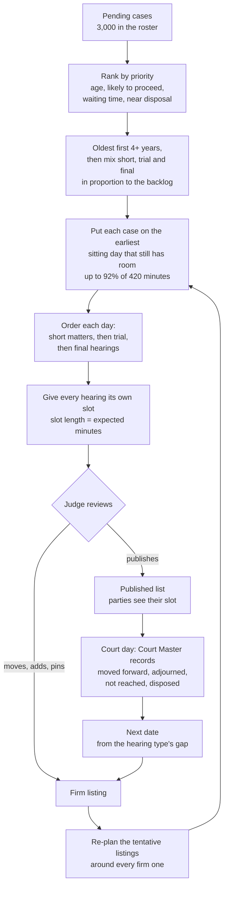
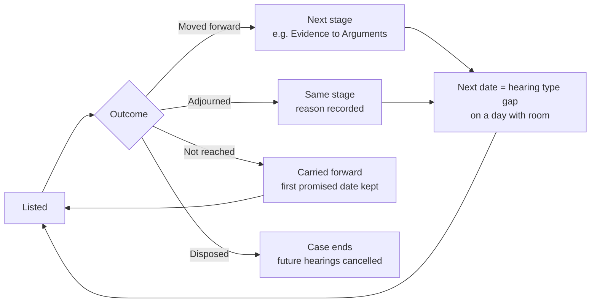

# Vihitha: court scheduling assistant

Vihitha plans a magistrate court's cause list. It gives **every pending case a date and a time slot**, keeps each day close to the court's real capacity (420 minutes), and **re-plans automatically** whenever the court records an outcome, gives a next date or the judge changes the list.

It has two parts:

- **The real schedule.** Cases, hearings and days are stored in SQLite. The judge and the Court Master work on this.
- **A what-if simulator.** It tries other rules on a copy of the schedule and shows the effect before anything is applied.

> Code: `backend/` (FastAPI + a pure-Python engine in `backend/vihitha/`) and `frontend/` (React).
> API shapes: `backend/API_CONTRACT_v3.md`. Run guide: `backend/README.md`.

---

## 1. The scheduling algorithm at a glance



**In words:**

1. **Rank.** Every pending case gets a priority score:
   - age (35%)
   - chance the hearing moves the case forward (30%)
   - days waiting (20%)
   - how close it is to disposal (15%)

   A 4+ year case close to its 30-day limit gets a large boost (guardrail).
2. **Mix.** Cases 4+ years old go first. Inside each age tier the three hearing groups (short, trial, final) take turns in proportion to how much court time each group needs. So a day is never "all judgements".
3. **Place, filling each day first.** Each case goes on the **earliest** sitting day that still has room, because a free minute today is lost for good. The only exceptions are the judge's own rules (for example a purpose-of-the-day rule) and bringing an advocate's matters together on the same day.
4. **Order the day.** Short matters are called first, so parties can leave quickly, then trial stages, then arguments and judgements.
5. **Slot.** Every hearing gets its own start time and queue number, back to back with no gaps or overlaps. The slot length is the hearing's *expected* minutes (section 3).
6. **Three kinds of day:**
   - **Published:** firm, and visible to parties.
   - **Draft:** the next 20 sitting days, the judge's working list.
   - **Tentative:** everything later. Every one of the 3,000 cases has a date, currently through Feb 2027.
7. **Re-plan on every change.** Court orders (next dates, carry-forwards) and judge edits are **firm**. The planner's own listings are **soft**, and after any change the soft listings are re-placed around the firm ones. Each re-plan takes about 1–2 seconds for 3,000 cases.

---

## 2. How each data point provided is used

| File (organisers' `data/`) | What it contains | How Vihitha uses it |
|---|---|---|
| `roster_sample_100.csv` | 100 cases: filing date, advocate, current stage, next purpose, last hearing summary, hearings held per type | The docket. It is bootstrapped to **3,000 cases** with the organisers' `generate_roster.py` logic (seed 42; "more of the same mix"). **Filing date** gives age and priority. **Stage and next purpose** give the hearing type and time. **Hearings per type** show how long a case has been stuck at a stage. **Last hearing summary** is parsed for attendance, pending summons or warrant, mediation and "last chance". |
| `court_calendar.csv` | Working days, weekends and holidays (Sep–Dec 2026) | Nothing is ever listed on a non-sitting day. The judge's leave is added on top. |
| `hearing_type_reference.csv` | For each hearing type: minutes per hearing, days to the next hearing, min/median/max hearings per case | **Minutes** give slot length and day load. **Days to next hearing** is the next-date target. **Median/max hearings** flag cases "stuck at stage". |
| `substantiveness_by_hearing_type.csv` | For each type: % of hearings that move the case forward | Expected minutes, the "likely / uncertain / unlikely" dot, the forecast of when a case ends, and the simulator |
| `hearing_failure_reasons.csv` | Why hearings don't go ahead (absence, not ready, awaiting process, …) | The adjournment reasons in the outcome form. The share of absences gives the show-up rate. "Awaiting process" holds a case until the summons or warrant is back. The simulator samples reasons from it. |
| `sample_causelist_2026-09-22.csv` | The shape of a cause list | The export (`proposed_schedule.csv`, `cause-list.csv`) starts with the same 4 columns |

Reference values used by the planner:

| Hearing type | Group | Full length (min) | Moves forward | Next hearing after (days) | Expected minutes | Slot at 92% fill |
|---|---|---|---|---|---|---|
| Admission | Short | 5 | 49% | 5 | 4.0 | ~4 |
| Delay condonation | Short | 5 | 29% | 5 | 3.6 | ~4 |
| Cognizance | Short | 10 | 90% | 14 | 9.3 | ~10 |
| Appearance | Short | 10 | 40% | 21 | 5.8 | ~6 |
| Warrant | Short | 10 | 14% | 21 | 3.9 | ~4 |
| Bail | Short | 15 | 31% | 14 | 6.8 | ~7 |
| Reports | Short | 10 | 8% | 45 | 3.6 | ~4 |
| Application review | Short | 10 | 85% | 5 | 8.9 | ~10 |
| Plea | Trial | 15 | 90% | 14 | 13.8 | ~15 |
| Examination u/s 351 BNSS | Trial | 30 | 41% | 14 | 14.0 | ~15 |
| Complainant evidence | Trial | 30 | 29% | 14 | 10.9 | ~12 |
| Defence evidence | Trial | 30 | 17% | 14 | 7.5 | ~8 |
| Arguments | Final | 30 | 13% | 14 | 6.5 | ~7 |
| Judgement | Final | 30 | ~100% | 21 | ~29.7 | ~32 |

---

## 3. Why one case gets 30 minutes and another gets 7

The data has **no clock times**, only how long a hearing takes *if it goes ahead* and how likely it is to go ahead. Vihitha combines the two:

```
expected minutes = P(goes ahead) × full length  +  (1 − P(goes ahead)) × 3 min adjournment call
slot length      = expected minutes ÷ fill target (0.92)
estimated end    = slot start + full length   (if it does go ahead)
```

**Worked examples:**

| Case | Full length | Chance it goes ahead | Expected | Slot |
|---|---|---|---|---|
| **Judgement** (order is ready, almost always delivered) | 30 min | ~100% | 29.7 min | **~30 min** |
| **Arguments** (usually adjourned: 13%) | 30 min | 13% | 0.13 × 30 + 0.87 × 3 = **6.5 min** | **~7 min** |
| **Admission** | 5 min | 49% | 4.0 min | **~4 min** |

**What moves the chance for an individual case:**

- **Learning show-up.** Each case keeps a record of whether its parties turned up. Repeat no-shows get a lower chance, so a shorter slot and lower priority.
- **Pending summons or warrant.** The case is held back entirely until the process is due back. Listing it would only produce an adjournment.
- **Case summary rule** (Dimakar preset). For 4+ year cases this removes 30% of "not ready" failures, raising the chance.

So the **slot is the case's fair share of the day**. The **estimated end** shows how long it would run if it goes ahead in full.

---

## 4. What extra cases do to the rest of the day

The day is deliberately **overbooked by expectation**: 27–35 hearings whose *expected* minutes add up to about 386 of 420 (92%). Most short or uncertain matters take a few minutes, so this fills the day. The question is what happens when reality differs.

```mermaid
gantt
    title One court morning: planned slots vs what happens when #2 goes ahead in full
    dateFormat HH:mm
    axisFormat %H:%M
    section Planned
    1 Admission (4 min)          :p1, 10:00, 4m
    2 Arguments (7 min slot)     :p2, after p1, 7m
    3 Plea (15 min)              :p3, after p2, 15m
    4 Evidence (12 min)          :p4, after p3, 12m
    section Actual
    1 Admission adjourned (3)    :a1, 10:00, 3m
    2 Arguments go ahead (30)    :crit, a2, after a1, 30m
    3 Plea (15, starts 22 min late) :a3, after a2, 15m
    4 Evidence (12, 22 min late) :a4, after a3, 12m
```



1. **A hearing runs longer than its slot.** Everyone after it is **called later**, in the same order. No one is skipped or reordered.
   - The public page shows parties "running about 22 minutes late, expected around 10:48".
   - Hearings that finish early pull the list back, because most slots are an average of short adjournments and a few full hearings.
2. **The day runs out (17:30).** Hearings not reached are marked **Not reached** when the day is closed. They are then carried forward automatically:
   - Default rules: the earliest day with room, plus a priority boost.
   - Sehgal preset: the same weekday next week.

   Their **first promised date is kept**, so the "heard on promised date" metric shows the slip.
3. **The 8% buffer.** Filling to 92% instead of 100% is what keeps this rare. On the 3,000-case run:
   - at 100%: about 86% of listed hearings are reached
   - at 92%: about 96% are reached (the default)
4. **The judge adds or moves a case onto a day.**
   - It becomes a **firm** listing, and the impact preview shows the effect before you apply it: day load before and after, the 4 KPI changes over 30 days, and any 4+ year case pushed past its 30-day limit.
   - When applied, the planner moves that day's lowest-priority **tentative** listings to later days so the day stays near 92%. Each moved case gets a new tentative date.
   - Published hearings are never moved, except by an explicit, confirmed edit.
5. **A next date lands on a busy day.** A next date given in court is a court order. It always gets its place, and tentative listings make way the same way.

---

## 5. A case's life and next dates



- **The 11 stages:** Admission → (Delay condonation) → Cognizance → Appearance → (Warrant) → Plea → Examination u/s 351 → Complainant evidence → Defence evidence → Arguments → Judgement.
- **Next date.**
  - The target is the reference gap for the next hearing type (Admission 5 days, Evidence 14, Appearance 21, Reports 45).
  - Vihitha searches from the gap to 1.5 × the gap for a day with room. It prefers a day the case's advocate is already in court, and respects the judge's purpose-of-the-day rules.
  - It tells the judge how much sooner this is than the old flat 60-day practice.
- **Awaiting process.** "Issue summons / warrant" in the order puts the case on hold until the process is due back.
- **Warrant.** Two absences in a row at Appearance move the case to Warrant.

### When will a case end? (shown on every case)

For each pending case, Vihitha simulates **200 possible futures** from its current stage:

- For each remaining stage, the number of hearings needed is random, based on the stage's "moves forward" chance. At 13%, Arguments needs about 7.7 hearings on average; at 90%, Plea needs about 1.1.
- Each hearing is followed by that type's reference gap.
- A small settlement chance (2% per hearing) can end the case early.

It shows the **range** of end dates (the 10th to 90th percentile, most likely in between), the chance it ends by 31 Dec, and which stage is slowest. For the 3,000-case roster, the median case ends in about 6 months. Arguments and Defence evidence are the main drag.

---

## 6. Rules the judge controls

**Where rules are edited:**
- **Settings → Rulesets** is the full editor: time blocks, priority weights, how full to plan the day, advocate clustering, purpose-of-the-day, carry-forward, prerequisite check, next-date mode.
- **What-If** shows a chosen day, the next month and 4 KPIs under any rules, compared with the current rules or with the baseline. **Apply these rules** re-plans the draft and tentative days.

**Presets:**

| Preset | How it lists cases |
|---|---|
| **Optimal** (default) | No fixed time bands. Mixed days, short calls first. Oldest and most-likely-to-proceed first. 92% fill. |
| Sehgal | Fixed blocks: carried-forward matters, fresh and notice matters, then oldest matters after lunch |
| Dimakar | Advocate clustering and purpose days (appearances early in the week, evidence mid-week, arguments on Friday) |
| Joshi | New matters first (clamped by the guardrails) |
| Baseline | The case study's current practice: 60 a day, a flat 60-day next date |

**Guardrails** (they can't be switched off; values below the floor are clamped, with a warning):
- at least 25% of each day for 4+ year cases
- age weight at least 0.2
- every 4+ year case listed within 30 days

---

## 7. Results (3,000 cases, 24 Sep – 31 Dec 2026, 68 sitting days)

`python -m vihitha.cli run --roster ../data/roster_3000.csv --preset optimal`

| Official metric | Vihitha | Baseline (60/day, flat 60 days) |
|---|---|---|
| Utilisation (share of the 420 minutes used) | 92.0% | 99.5% |
| Reach rate (listed hearings actually reached) | **95.9%** | 71.6% |
| Substantiveness (reached hearings that moved forward) | 33.8% | 33.9% |
| Backlog-age impact (4+ year cases heard) | **98.3%** | 69.8% |
| Predictability (days late vs first promised date) | **0.3** | 4.7 |
| Next-date sanity (next date within the legal range) | **100%** | 7.8% |

The baseline "uses" more minutes because it lists 60 a day and runs until closing, leaving 28% of listed parties unheard. Vihitha lists what can realistically be heard and gives each party a time. 96.8% of hearings happen on the first date promised.

---

## 8. Assumptions (all configurable)

**Court day and planning**
- The court day runs 10:00–17:30 with lunch 13:30–14:00 (420 minutes).
- Days are planned to 92% of expected minutes.
- An adjournment takes 3 minutes of court time.
- The draft horizon is 20 sitting days; tentative dates are planned up to 2 years ahead.
- Lists are published about 5 sitting days ahead (the simulator assumes this).
- Days after the organisers' calendar (after 31 Dec 2026) are treated as Mon–Fri sitting days.

**Outcome model**
- Settlement or withdrawal: 2% per reached hearing.
- Hearing durations vary lognormally around the reference minutes.
- A required case summary removes 30% of "not ready" failures.
- Two absences at Appearance move the case to Warrant.
- Delay condonation is skipped unless the case already had such hearings.
- A summons pending at roster start returns within the reference gap.

---

## 9. How to run

```powershell
# backend
cd backend
py -3.12 -m venv .venv; .venv\Scripts\activate; pip install -e ".[dev]"
uvicorn api.main:app --reload --port 8000     # first start builds 3,000 cases and plans them

# frontend
cd frontend
npm install; npm run dev                       # http://localhost:5173
```
